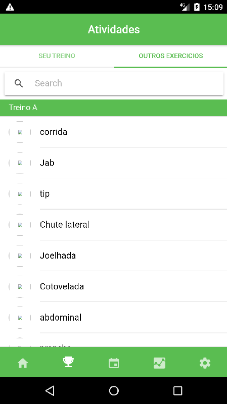
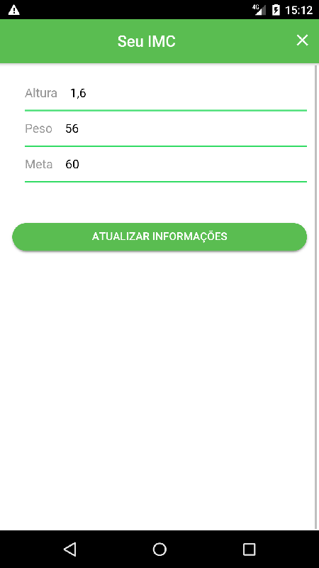

# Healfit

This is a starter template for [Ionic](http://ionicframework.com/docs/) projects.

## template








### With the Ionic CLI:

Take the name after `ionic2-starter-`, and that is the name of the template to be used when using the `ionic start` command below:

```bash
$ sudo npm install -g ionic cordova
$ ionic start myTabs tabs
```

Then, to run it, cd into `myTabs` and run:

```bash
$ ionic cordova platform add ios
$ ionic cordova run ios
```

Substitute ios for android if not on a Mac.

